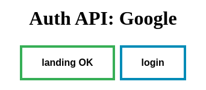

# AuthAPI

A Simple Python API for Authenticated Operations.



## Quickstart:

Let's assume you want to interact with Google Ads API.

1. Create a `app_secret.json` with the following information:

```json
{
    "client_id": "your-client-id",
    "client_secret": "your-client-secret"
    "authorize_url": "https://accounts.google.com/o/oauth2/auth",
    "access_token_url": "https://accounts.google.com/o/oauth2/token",
    "scopes": ["openid", "https://www.googleapis.com/auth/adwords"]
}
```

2. Upload `app_secret.json` to a your Secret Manager. Let's assume it's Google Cloud Secret Manager.

3. Create a `main.py` script and paste the following content.

```python
from authapi import AuthAPI
from authapi.authdata.google.google import AuthData
from cloudops_google_secretmanager import SecretManager

app_secret = SecretManager(
    project_id="project-id",
    secret_id="your-app-secret-id",
)

app_token = SecretManager(
    project_id="project-id",
    secret_id="your-token-secret-id",
)

auth_data = AuthData(**app_secret.pull())

app = AuthAPI(
    name="Google Ads",
    auth_data=auth_data,
    token_secret=app_token,
)

app.debug = True

@app.route("/run", methods=["GET", "POST"])
def run():
    return "Hello World!"


if __name__ == "__main__":
    app.run(ssl_context="adhoc")
```

4. Visit [https://127.0.0.1:5000/](https://127.0.0.1:5000/) to start the authentication process.

